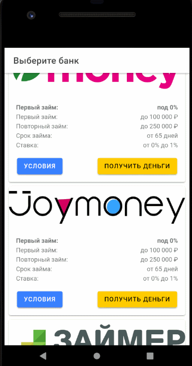

# CreditApp
## Платформы:

1. iOS (10+)
2. Android (4.4+)
3. Desktop:

| Browser  | Supported|
| ------------- | ------------- |
| Chrome  | ✔  |
| Safari  | ✔  |
| Edge  | ✔  |
| Firefox  | ✔  |

---
## Ресурсы:
Сборщик [**Ionic 4**](https://ionicframework.com/)

Фреймворк [**Angular**](https://angular.io/)

Язык программирования [**TypeScript**](https://www.typescriptlang.org/)

---
# Подготовка проекта (Winodws)
```
git clone https://mrpchelka.visualstudio.com/CreditApp/_git/CreditApp
cd CreditApp
npm install
ionic cordova resources
XCopy xml resources\android\xml\
ionic cordova prepare
```
----
